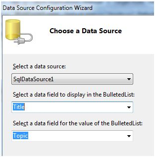
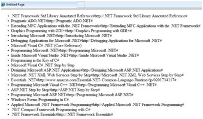
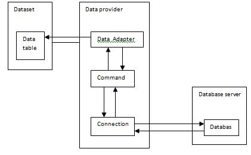
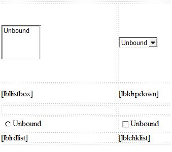
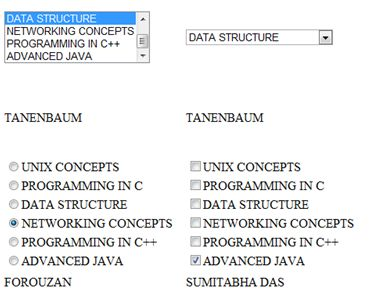

# ASP.NET - 数据绑定  

每一个 ASP.NET 网页表单控件从它的父控件类继承了 DataBind 方法，它给予了它继承的能力来绑定数据到它属性中的至少一个属性。这就是所谓的**简单数据绑定**或者**内部数据绑定**。  

简单数据绑定包括将任何实现 IEnumerable 接口的集合(项目集合)，或者 DataSet 和 DataTable 类附加到控件的 DataSource 属性。  

另一方面，一些控件可以通过 DataSource 控件绑定记录，列表，或者数据列到它们的结构中。这些控件源自 BaseDataBoundControl 类。这被叫做**描述性数据绑定**。  

data source 控件帮助 data-bound 控件实现了比如排序，分页和编辑数据集合的功能。  

BaseDataBoundControl 是一个抽象类，它通过两个抽象类继承：  

- DataBoundControl
- HierarchicalDataBoundControl

抽象类 DataBoundControl 也由两个抽象类继承：  

- ListControl
- CompositeDataBoundControl  

能够简单绑定数据的控件源自 ListControl 抽象类并且这些控件是：  

- BulletedList  
- CheckBoxList
- DropDownList
- ListBox
- RadioButtonList  

能够描述性数据绑定的控件(一个更复杂的数据绑定)源自抽象类 CompositeDataBoundControl。这是控件是：  

- DetailsView
- FormView
- GridView
- RecordList  

## 简单数据绑定  

简单数据绑定包括只读选择列表。这些控件能绑定一个数组列或者数据库的字段。选择列表从数据库中或 data source 中取两个值；一个值用过列表表示而另一个被认为是相应显示的值。  

让我们使用一个小例子来理解这个概念。用一个项目符号列表和一个 SqlDataSource 控件来创建一个网页。配置 data source 控件来从你的数据库中(我们在之前的章节中使用相同的 DotNetReferences 表)检索两个值。  

为包含的项目符号列表控件选择一个 data source：  

- 选择 data source 控件  
- 选择一个字段来展示，它被叫做数据字段  
- 选择值的字段  

  

当应用程序执行的时候，检查整个标题列绑定到项目符号列表并被展示。  

  

## 描述性数据绑定  

我们已经在之前的指南中使用 GridView 控件来使用描述性数据绑定。其他复合的能够以表格的方式展示并操作数据的 data bound 控件是  DetailsView,FormView 和 RecordList 控件。  

在下一个指南中，我们将调查解决数据库，i.e，ADO.NET 的 技术。  

但是，数据绑定包括以下对象：  

- 存储从数据库检索数据的数据集。
- 数据提供者，它通过使用一个连接的命令从数据库中检索数据。  
- 发出存储在 command 对象中的选择语句的数据适配器；它也能通过发出 Insert，Delete，和 Updata 语句来更新数据库中的数据。  

data bonding 对象间的关系：  



### 例子  

让我们采取以下的步骤：  

**步骤(1):**创建一个新的网页。通过右击在 Solution Explorer 上的 solution 名字和从 'Add Item' 对话框中选择项目 'Class' 来添加一个名为 booklist 的类。将它命名为 booklist.cs。  

```
using System;
using System.Data;
using System.Configuration;
using System.Linq;

using System.Web;
using System.Web.Security;
using System.Web.UI;
using System.Web.UI.HtmlControls;
using System.Web.UI.WebControls;
using System.Web.UI.WebControls.WebParts;

using System.Xml.Linq;

namespace databinding
{
   public class booklist
   {
      protected String bookname;
      protected String authorname;
      public booklist(String bname, String aname)
      {
         this.bookname = bname;
         this.authorname = aname;

      }
      
      public String Book
      {
         get
         {
            return this.bookname;
         }
         set
         {
            this.bookname = value;
         }
      }
      
      public String Author
      {
         get
         {
            return this.authorname;
         }
         set
         {
            this.authorname = value;
         }
      }
   }
}
```  

**步骤(2):**在页面上添加四个列表控件，一个 list box 控件，一个 radio button 控件，一个 check box 控件和一个 drop down list 和四个与这些列表控件一起的四个表单。在设计视图中页面应该看起来像这样：  



源文件应该看起来像下面这样：

```
<form id="form1" runat="server">
   <div>
   
      <table style="width: 559px">
         <tr>
            <td style="width: 228px; height: 157px;">
               <asp:ListBox ID="ListBox1" runat="server" AutoPostBack="True" 
                  OnSelectedIndexChanged="ListBox1_SelectedIndexChanged">
               </asp:ListBox>
            </td>

            <td style="height: 157px">
               <asp:DropDownList ID="DropDownList1" runat="server" 
                  AutoPostBack="True" OnSelectedIndexChanged="DropDownList1_SelectedIndexChanged">
               </asp:DropDownList>
            </td>             
         </tr>

         <tr>
            <td style="width: 228px; height: 40px;">
               <asp:Label ID="lbllistbox" runat="server"></asp:Label>
            </td>

            <td style="height: 40px">
               <asp:Label ID="lbldrpdown" runat="server">
               </asp:Label>
            </td>
         </tr>

         <tr>
            <td style="width: 228px; height: 21px">
            </td>

            <td style="height: 21px">
            </td>              
         </tr>

         <tr>
            <td style="width: 228px; height: 21px">
               <asp:RadioButtonList ID="RadioButtonList1" runat="server"
                  AutoPostBack="True"  OnSelectedIndexChanged="RadioButtonList1_SelectedIndexChanged">
               </asp:RadioButtonList>
            </td>

            <td style="height: 21px">
               <asp:CheckBoxList ID="CheckBoxList1" runat="server" 
                  AutoPostBack="True" OnSelectedIndexChanged="CheckBoxList1_SelectedIndexChanged">
               </asp:CheckBoxList>
            </td>                
         </tr>

         <tr>
            <td style="width: 228px; height: 21px">
               <asp:Label ID="lblrdlist" runat="server">
               </asp:Label>
            </td>

            <td style="height: 21px">
               <asp:Label ID="lblchklist" runat="server">
               </asp:Label>
            </td>           
         </tr>
      </table>      
      
   </div>
</form>
```  

**步骤(3):**最后，在应用程序的例行程序后写下面的代码：  

```
public partial class _Default : System.Web.UI.Page
{
   protected void Page_Load(object sender, EventArgs e)
   {
      IList bklist = createbooklist();
      
      if (!this.IsPostBack)
      {
         this.ListBox1.DataSource = bklist;
         this.ListBox1.DataTextField = "Book";
         this.ListBox1.DataValueField = "Author";
         
         this.DropDownList1.DataSource = bklist;
         this.DropDownList1.DataTextField = "Book";
         this.DropDownList1.DataValueField = "Author";
         
         this.RadioButtonList1.DataSource = bklist;
         this.RadioButtonList1.DataTextField = "Book";
         this.RadioButtonList1.DataValueField = "Author";
         
         this.CheckBoxList1.DataSource = bklist;
         this.CheckBoxList1.DataTextField = "Book";
         this.CheckBoxList1.DataValueField = "Author";
         
         this.DataBind();
      }
   }
   
   protected IList createbooklist()
   {
      ArrayList allbooks = new ArrayList();
      booklist bl;
      
      bl = new booklist("UNIX CONCEPTS", "SUMITABHA DAS");
      allbooks.Add(bl);
      
      bl = new booklist("PROGRAMMING IN C", "RICHI KERNIGHAN");
      allbooks.Add(bl);
      
      bl = new booklist("DATA STRUCTURE", "TANENBAUM");
      allbooks.Add(bl);
      
      bl = new booklist("NETWORKING CONCEPTS", "FOROUZAN");
      allbooks.Add(bl);
      
      bl = new booklist("PROGRAMMING IN C++", "B. STROUSTROUP");
      allbooks.Add(bl);
      
      bl = new booklist("ADVANCED JAVA", "SUMITABHA DAS");
      allbooks.Add(bl);
      
      return allbooks;
   }
   
   protected void ListBox1_SelectedIndexChanged(object sender, EventArgs e)
   {
      this.lbllistbox.Text = this.ListBox1.SelectedValue;
   }
   
   protected void DropDownList1_SelectedIndexChanged(object sender, EventArgs e)
   {
      this.lbldrpdown.Text = this.DropDownList1.SelectedValue;
   }
   
   protected void RadioButtonList1_SelectedIndexChanged(object sender, EventArgs e)
   {
      this.lblrdlist.Text = this.RadioButtonList1.SelectedValue;
   }
   
   protected void CheckBoxList1_SelectedIndexChanged(object sender, EventArgs e)
   {
      this.lblchklist.Text = this.CheckBoxList1.SelectedValue;
   }
}
```

观察以下：  

- booklist 类有两个属性：bookname 和 authorname。  
- createbooklist 方法是一个用户定义的可以创建名为 allboods 的 booklist 类的数组的方法。  
- Page_Load 事件句柄确保了 books 的列表被创建。该列表是 IList 型的，它实现了 IEnumerable 接口并能和列表控件绑定。Page load 时间句柄用控件绑定了 IList 对象'bklist'。bookname 属性被展示并且 authorname　属性被视为这个值。　　
- 当页面运行时，如果用户选择了一本书，则它的名字被选择并且通过 list 控件被显示出来，而相应的标签显示作者的名字，它是 list 控件所选择的相应的值。


